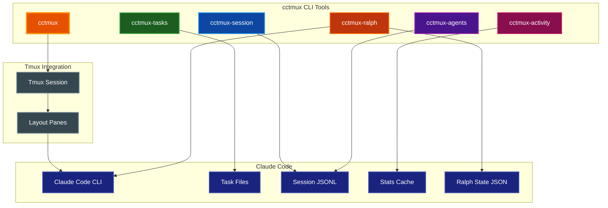

# cctmux

Launch Claude Code inside tmux with session management, real-time monitoring, and pane awareness.


[](https://buymeacoffee.com/probello3)


## Table of Contents

- [Features](#features)
- [Installation](#installation)
- [Quick Start](#quick-start)
- [CLI Tools](#cli-tools)
- [Layouts](#layouts)
- [Monitoring Tools](#monitoring-tools)
  - [Ralph Monitor](#ralph-monitor-cctmux-ralph)
- [Configuration](#configuration)
- [Claude Skill](#claude-skill)
- [Environment Variables](#environment-variables)
- [Requirements](#requirements)
- [Development](#development)
- [Documentation](#documentation)
- [License](#license)

## Features

- **Session Management**: Create and attach to tmux sessions named after your project folder
- **Predefined Layouts**: Choose from 9 layouts including monitoring-focused arrangements
- **Real-time Monitors**: Track tasks, session events, subagents, usage statistics, and Ralph Loop progress
- **Ralph Loop Automation**: Automated iterative Claude Code execution with task tracking and cost monitoring
- **Claude Awareness**: Environment variables (`$CCTMUX_SESSION`, `$CCTMUX_PROJECT_DIR`) for Claude integration
- **Session History**: Track recent sessions with fzf integration for quick switching
- **Configuration Presets**: Quick access to minimal, verbose, or debug configurations
- **Status Bar**: Optional tmux status bar showing git branch and project info
- **Claude Skill**: Enables Claude to manage tmux panes for dev servers, watchers, etc.
- **Dry Run Mode**: Preview tmux commands without executing



## Installation

### Using uv (Recommended)

```bash
uv tool install cctmux
```

### From GitHub

```bash
uv tool install git+https://github.com/paulrobello/cctmux.git
```

### Using pip

```bash
pip install cctmux
```

### From Source

```bash
git clone https://github.com/paulrobello/cctmux.git
cd cctmux
uv sync
uv run cctmux --help
```

## Quick Start

```bash
# Launch Claude Code in tmux for current project
cd ~/my-project
cctmux

# Start with monitoring layout (Claude + session monitor + task monitor)
cctmux -l cc-mon

# Select from recent sessions
cctmux --recent

# Preview commands without executing
cctmux --dry-run

# Start a Ralph Loop with monitoring layout
cctmux -l ralph
```

## CLI Tools

cctmux provides six CLI commands:

| Command | Purpose |
|---------|---------|
| `cctmux` | Launch Claude Code in a tmux session |
| `cctmux-tasks` | Monitor Claude Code tasks in real-time |
| `cctmux-session` | Monitor session events and statistics |
| `cctmux-agents` | Monitor subagent activity |
| `cctmux-activity` | Display usage statistics dashboard |
| `cctmux-ralph` | Ralph Loop automation (start, monitor, cancel, status, init) |

### cctmux

Main session launcher.

```bash
cctmux [OPTIONS]
```

| Option | Short | Description |
|--------|-------|-------------|
| `--layout` | `-l` | Tmux layout (default, editor, monitor, triple, cc-mon, full-monitor, dashboard, ralph, ralph-full) |
| `--recent` | `-r` | Select from recent sessions using fzf |
| `--status-bar` | `-s` | Enable status bar with git/project info |
| `--claude-args` | `-a` | Arguments to pass to claude command |
| `--task-list-id` | `-T` | Set `CLAUDE_CODE_TASK_LIST_ID` env var |
| `--dry-run` | `-n` | Preview commands without executing |
| `--config` | `-c` | Custom config file path |
| `--dump-config` | | Output current configuration |
| `--debug` | `-D` | Enable debug output |
| `--verbose` | `-v` | Increase verbosity (stackable) |

**Subcommands:**

```bash
cctmux init-config    # Create default configuration file
cctmux install-skill  # Install the cc-tmux skill for Claude
```

## Layouts

| Layout | Description |
|--------|-------------|
| `default` | No initial splits (panes created on demand) |
| `editor` | 70/30 horizontal split (main + side pane) |
| `monitor` | 80/20 vertical split (main + bottom bar) |
| `triple` | Main pane with two side panes (30% right, split vertically) |
| `cc-mon` | Claude + session monitor + task monitor |
| `full-monitor` | Claude + session + tasks + activity monitors |
| `dashboard` | Large activity dashboard with session sidebar |
| `ralph` | Shell + ralph monitor side-by-side (60/40) |
| `ralph-full` | Shell + ralph monitor + task monitor |

### CC-Mon Layout

The recommended layout for monitoring Claude Code activity:

```bash
cctmux -l cc-mon
```

```
┌──────────────────┬──────────────────┐
│                  │ cctmux-session   │
│                  │      50%         │
│   Claude Code    ├──────────────────┤
│      50%         │ cctmux-tasks -g  │
│                  │      50%         │
│                  │                  │
└──────────────────┴──────────────────┘
```

## Monitoring Tools

### Task Monitor (`cctmux-tasks`)

Watch task progress with ASCII dependency visualization.

```bash
cctmux-tasks                    # Auto-detect from current project
cctmux-tasks abc123             # Monitor specific session
cctmux-tasks --list             # List available sessions
cctmux-tasks -g                 # Show only dependency graph
cctmux-tasks --preset verbose   # Use verbose preset
```

**Features:**
- ASCII dependency graph with task relationships
- Status indicators: `○` pending, `◐` in progress, `●` completed
- Progress statistics and completion percentage
- Acceptance criteria tracking from metadata
- Windowed virtual scrolling for large task lists

### Session Monitor (`cctmux-session`)

Track session events in real-time.

```bash
cctmux-session                  # Auto-detect from current project
cctmux-session abc123           # Monitor specific session
cctmux-session --list           # List available sessions
cctmux-session --no-thinking    # Hide thinking blocks
cctmux-session --preset debug   # Use debug preset
```

**Features:**
- Tool calls and results display
- Thinking block visualization
- Token usage and cost estimates
- Tool usage histogram
- Stop reason and turn duration tracking

### Subagent Monitor (`cctmux-agents`)

Monitor subagent activity across parallel tasks.

```bash
cctmux-agents                   # Auto-detect from current project
cctmux-agents abc123            # Monitor specific session
cctmux-agents --list            # List available subagents
cctmux-agents --no-activity     # Hide activity panel
```

**Features:**
- Active and completed subagent tracking
- Token usage per agent
- Current activity display
- Aggregate statistics

### Activity Dashboard (`cctmux-activity`)

View usage statistics from Claude Code.

```bash
cctmux-activity                 # Show default dashboard
cctmux-activity --days 7        # Show 7-day heatmap
cctmux-activity --show-hourly   # Include hourly distribution
cctmux-activity --no-cost       # Hide cost estimates
```

**Features:**
- Session and message totals
- Model usage breakdown with cost estimates
- Activity heatmap visualization
- Hourly distribution chart

### Ralph Monitor (`cctmux-ralph`)

Automated iterative Claude Code execution with live monitoring.

```bash
cctmux-ralph                          # Monitor a running Ralph Loop
cctmux-ralph start ralph-project.md   # Start a Ralph Loop from project file
cctmux-ralph init                     # Create a template project file
cctmux-ralph status                   # Show current Ralph Loop status
cctmux-ralph cancel                   # Cancel an active Ralph Loop
```

**Features:**
- Iteration progress and task completion tracking
- Token usage and cost estimates per iteration
- Timeline visualization of loop progress
- Completion detection via task checks, promise tags, or max iterations

## Configuration

Config file location: `~/.config/cctmux/config.yaml`

```yaml
# Main settings
default_layout: default
status_bar_enabled: false
max_history_entries: 50
default_claude_args: null
task_list_id: false

# Session monitor settings
session_monitor:
  show_thinking: true
  show_results: true
  show_progress: true
  show_cwd: false
  show_threading: false
  max_events: 50

# Task monitor settings
task_monitor:
  show_owner: true
  show_metadata: false
  show_description: true
  show_graph: true
  show_table: true
  max_tasks: 100

# Activity monitor settings
activity_monitor:
  default_days: 7
  show_heatmap: true
  show_cost: true
  show_tool_usage: true
  show_model_usage: true

# Agent monitor settings
agent_monitor:
  inactive_timeout: 300.0

# Ralph monitor settings
ralph_monitor:
  show_table: true
  show_timeline: true
  show_prompt: false
  show_task_progress: true
  max_iterations_visible: 20
```

### Configuration Presets

All monitors support `--preset` for quick configuration:

| Preset | Description |
|--------|-------------|
| `minimal` | Essential info only, reduced visual noise |
| `verbose` | All information displayed |
| `debug` | Maximum detail for troubleshooting |

```bash
cctmux-session --preset minimal
cctmux-tasks --preset verbose
cctmux-activity --preset debug
cctmux-ralph --preset verbose
```

### Create Default Config

```bash
cctmux init-config
```

## Claude Skill

Install the skill for Claude to manage tmux panes:

```bash
cctmux install-skill
```

Once installed, Claude can:

- **Discover Session Context**: Access `$CCTMUX_SESSION` and `$CCTMUX_PROJECT_DIR`
- **Create Panes**: Split windows for dev servers, file watchers, test runners
- **Manage Processes**: Start, stop, and restart background processes
- **Navigate Panes**: Move focus between panes programmatically

### Using the Skill

Simply ask Claude to manage your development environment:

```
Start a dev server in a side pane
```

```
Set up panes for frontend server and test watcher
```

```
Run pytest in watch mode in a side pane
```

```
Restart the dev server - it crashed
```

Claude will automatically detect the cctmux session and manage panes appropriately.

### Skill Pattern

The skill follows a "create then launch" pattern using pane IDs for reliable targeting:

```bash
# Create pane and capture its ID
PANE=$(tmux split-window -d -P -F "#{pane_id}" -t "$CCTMUX_SESSION" -h -p 30)

# Launch application using pane ID
tmux send-keys -t "$PANE" "npm run dev" Enter
```

For detailed usage examples and best practices, see the [Skill Guide](docs/SKILL_GUIDE.md).

## Environment Variables

Inside a cctmux session:

| Variable | Description |
|----------|-------------|
| `CCTMUX_SESSION` | The tmux session name |
| `CCTMUX_PROJECT_DIR` | The project directory path |
| `CLAUDE_CODE_TASK_LIST_ID` | Session name (if `--task-list-id` enabled) |

## Requirements

- **Python**: 3.14+
- **tmux**: Terminal multiplexer
- **Claude Code**: Claude Code CLI (`claude`)
- **fzf**: Optional, for `--recent` session selection

## Development

```bash
# Clone and install
git clone https://github.com/paulrobello/cctmux.git
cd cctmux
uv sync

# Run all checks (format, lint, typecheck, test)
make checkall

# Individual commands
make fmt        # Format code
make lint       # Lint code
make typecheck  # Type check
make test       # Run tests
```

## Documentation

Full documentation is available in the `docs/` directory:

- [Quick Start Guide](docs/QUICKSTART.md) - Get started in minutes
- [Architecture](docs/ARCHITECTURE.md) - System design and data flow
- [CLI Reference](docs/CLI_REFERENCE.md) - Complete reference for all six entry points
- [Layouts Reference](docs/LAYOUTS.md) - All nine predefined layouts with diagrams
- [Skill Guide](docs/SKILL_GUIDE.md) - Using the cc-tmux skill with Claude
- [Configuration](docs/CONFIGURATION.md) - Configuration options and presets

## License

This project is licensed under the MIT License - see the [LICENSE](LICENSE) file for details.
