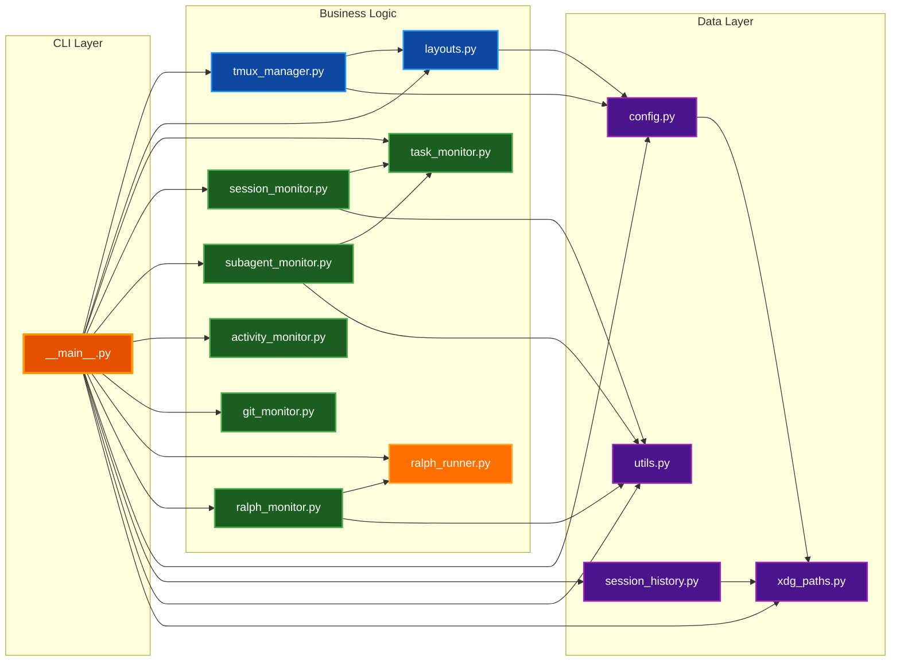
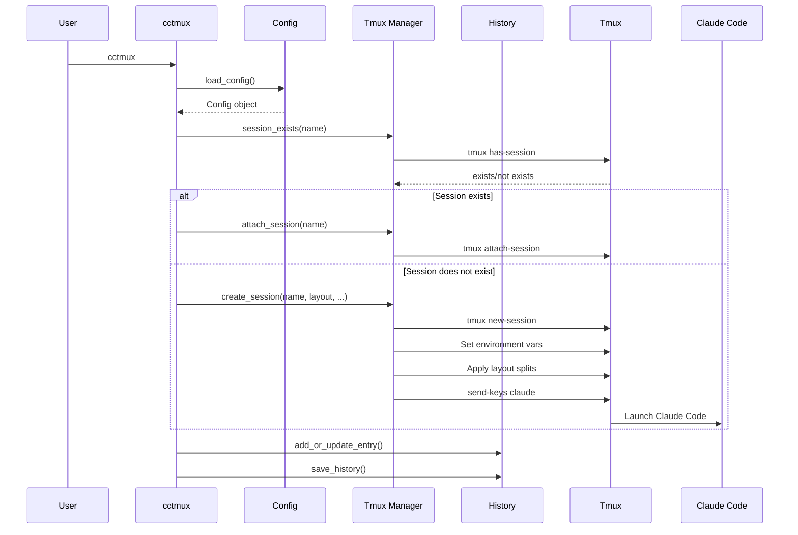
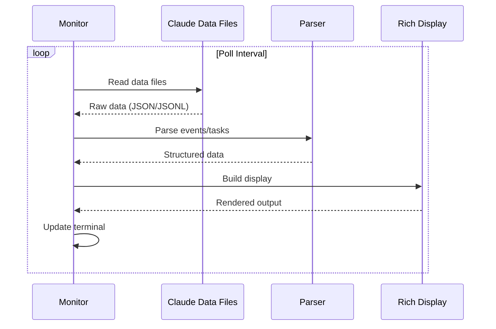
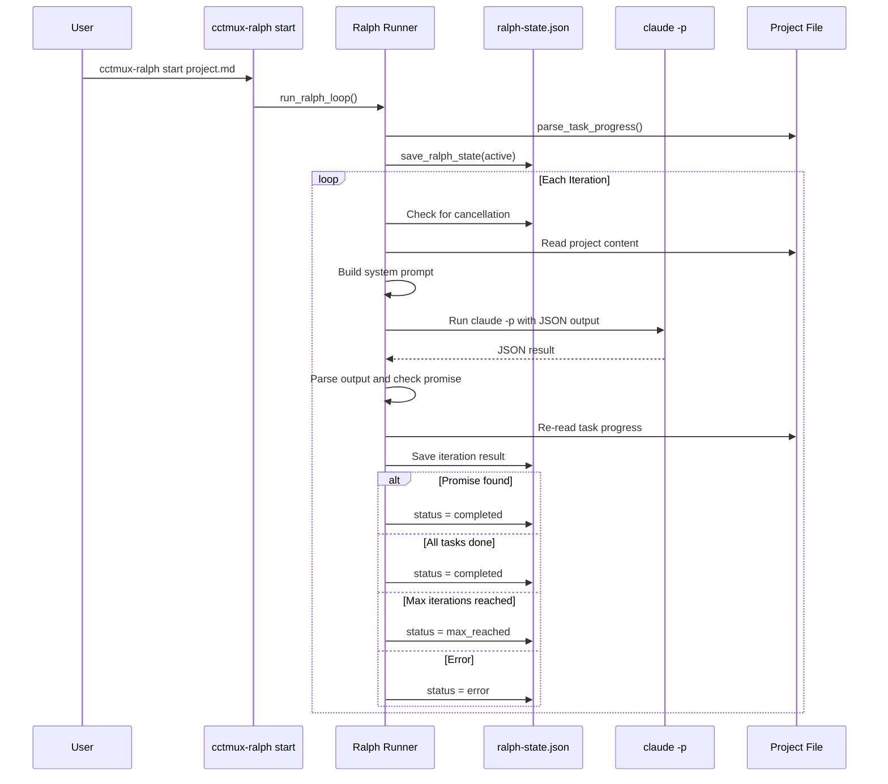
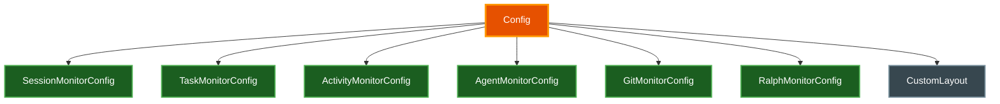

# Architecture

System design and data flow for cctmux. This document describes how the components interact and where data is stored.

## Table of Contents

- [Overview](#overview)
- [Component Architecture](#component-architecture)
- [Data Flow](#data-flow)
- [File Locations](#file-locations)
- [Module Structure](#module-structure)
- [Configuration System](#configuration-system)
- [Layout System](#layout-system)
- [Related Documentation](#related-documentation)

## Overview

cctmux is a CLI toolset that integrates Claude Code with tmux for enhanced session management and monitoring. The system consists of seven CLI entry points that share common modules for configuration, session tracking, and display rendering.



```mermaid
graph TB
    subgraph "User Interface"
        CLI[CLI Commands]
        Term[Terminal Display]
    end

    subgraph "Core Components"
        Config[Configuration]
        TmuxMgr[Tmux Manager]
        History[Session History]
    end

    subgraph "Monitors"
        TaskMon[Task Monitor]
        SessionMon[Session Monitor]
        AgentMon[Subagent Monitor]
        ActivityMon[Activity Monitor]
        GitMon[Git Monitor]
        RalphMon[Ralph Monitor]
    end

    subgraph "Ralph Loop"
        RalphRunner[Ralph Runner]
        RalphState[Ralph State]
    end

    subgraph "External Systems"
        Tmux[tmux]
        ClaudeCode[Claude Code]
        ClaudeData[Claude Data Files]
        GitRepo[Git Repository]
    end

    CLI --> Config
    CLI --> TmuxMgr
    CLI --> History
    CLI --> TaskMon
    CLI --> SessionMon
    CLI --> AgentMon
    CLI --> ActivityMon
    CLI --> GitMon
    CLI --> RalphRunner
    CLI --> RalphMon

    TmuxMgr --> Tmux
    Tmux --> ClaudeCode

    TaskMon --> ClaudeData
    SessionMon --> ClaudeData
    AgentMon --> ClaudeData
    ActivityMon --> ClaudeData
    GitMon --> GitRepo

    TaskMon --> Term
    SessionMon --> Term
    AgentMon --> Term
    ActivityMon --> Term
    GitMon --> Term
    RalphMon --> Term
    RalphRunner --> ClaudeCode
    RalphRunner --> RalphState

    style CLI fill:#e65100,stroke:#ff9800,stroke-width:3px,color:#ffffff
    style Term fill:#e65100,stroke:#ff9800,stroke-width:2px,color:#ffffff
    style Config fill:#0d47a1,stroke:#2196f3,stroke-width:2px,color:#ffffff
    style TmuxMgr fill:#0d47a1,stroke:#2196f3,stroke-width:2px,color:#ffffff
    style History fill:#0d47a1,stroke:#2196f3,stroke-width:2px,color:#ffffff
    style TaskMon fill:#1b5e20,stroke:#4caf50,stroke-width:2px,color:#ffffff
    style SessionMon fill:#1b5e20,stroke:#4caf50,stroke-width:2px,color:#ffffff
    style AgentMon fill:#1b5e20,stroke:#4caf50,stroke-width:2px,color:#ffffff
    style ActivityMon fill:#1b5e20,stroke:#4caf50,stroke-width:2px,color:#ffffff
    style GitMon fill:#1b5e20,stroke:#4caf50,stroke-width:2px,color:#ffffff
    style RalphMon fill:#1b5e20,stroke:#4caf50,stroke-width:2px,color:#ffffff
    style RalphRunner fill:#ff6f00,stroke:#ffa726,stroke-width:2px,color:#ffffff
    style RalphState fill:#1a237e,stroke:#3f51b5,stroke-width:2px,color:#ffffff
    style Tmux fill:#37474f,stroke:#78909c,stroke-width:2px,color:#ffffff
    style ClaudeCode fill:#4a148c,stroke:#9c27b0,stroke-width:2px,color:#ffffff
    style ClaudeData fill:#1a237e,stroke:#3f51b5,stroke-width:2px,color:#ffffff
    style GitRepo fill:#004d40,stroke:#00897b,stroke-width:2px,color:#ffffff
```

## Component Architecture

### CLI Entry Points

| Entry Point | Module | Purpose |
|-------------|--------|---------|
| `cctmux` | `__main__.py:app` | Main session launcher with `install-skill` and `init-config` subcommands |
| `cctmux-tasks` | `__main__.py:tasks_app` | Task monitor with dependency graphs |
| `cctmux-session` | `__main__.py:session_app` | Session event monitor with statistics |
| `cctmux-agents` | `__main__.py:agents_app` | Subagent activity monitor |
| `cctmux-activity` | `__main__.py:activity_app` | Usage statistics dashboard |
| `cctmux-git` | `__main__.py:git_app` | Real-time git repository status monitor |
| `cctmux-ralph` | `__main__.py:ralph_app` | Ralph Loop automation with `start`, `init`, `cancel`, and `status` subcommands |

### Core Modules



## Data Flow

### Session Creation Flow



Session creation sets environment variables at the tmux session level: `CCTMUX_SESSION`, `CCTMUX_PROJECT_DIR`, and optionally `CLAUDE_CODE_TASK_LIST_ID` (when `--task-list-id` is used). These are also exported into the shell so that Claude Code and layout pane commands can reference them.

### Monitor Data Flow



All monitors auto-detect new sessions. When no explicit session or path is provided, the monitor searches for the most recent session associated with the current project directory using the encoded project path.

### Ralph Loop Flow



Ralph Loop completion is detected via three mechanisms: all checklist items in the project file are checked (`- [x]`), the `<promise>` tag containing the expected text appears in the output, or the maximum iteration count is reached. State is written atomically via temp files so the Ralph monitor can safely read concurrently.

## File Locations

### cctmux Data

| Purpose | Location |
|---------|----------|
| Configuration | `~/.config/cctmux/config.yaml` |
| Session History | `~/.local/share/cctmux/history.yaml` |
| Skill Files | `~/.claude/skills/cc-tmux/` |

### Claude Code Data

| Purpose | Location |
|---------|----------|
| Task Files | `~/.claude/tasks/<session-id>/*.json` |
| Session Transcripts | `~/.claude/projects/<encoded-path>/<session-id>.jsonl` |
| Subagent Transcripts | `~/.claude/projects/<encoded-path>/agent-*.jsonl` or `<session-id>/subagents/agent-*.jsonl` |
| Stats Cache | `~/.claude/stats-cache.json` |
| Ralph State | `$PROJECT/.claude/ralph-state.json` |

### Path Encoding

Project paths are encoded for Claude folder lookups by replacing `/` with `-`:

```
/Users/alice/repos/my-project → -Users-alice-repos-my-project
```

## Module Structure

```
src/cctmux/
├── __init__.py           # Package version
├── __main__.py           # CLI entry points (7 Typer apps)
├── config.py             # Configuration models and presets
├── session_history.py    # Session tracking with Pydantic
├── tmux_manager.py       # Core tmux operations
├── layouts.py            # Predefined layout implementations
├── task_monitor.py       # Task monitor with dependency graphs
├── session_monitor.py    # Session event monitor
├── subagent_monitor.py   # Subagent activity monitor
├── activity_monitor.py   # Usage dashboard
├── git_monitor.py        # Real-time git status monitor
├── ralph_runner.py       # Ralph Loop engine
├── ralph_monitor.py      # Ralph Loop live dashboard
├── xdg_paths.py          # XDG-compliant path management
└── utils.py              # Shared utilities
```

### Module Responsibilities

| Module | Responsibility |
|--------|----------------|
| `config.py` | Pydantic models for config, monitor-specific configs, presets (`default`, `minimal`, `verbose`, `debug`), YAML I/O |
| `session_history.py` | Track recent sessions, LRU management, Pydantic models with YAML serialization |
| `tmux_manager.py` | Session creation, attachment, environment variable setup, status bar configuration |
| `layouts.py` | Pane splitting with captured pane IDs, command execution per layout |
| `task_monitor.py` | Parse task JSON, build ASCII dependency graphs, windowed virtual scrolling |
| `session_monitor.py` | Parse JSONL events, compute statistics, cost estimation, path compression |
| `subagent_monitor.py` | Discover and monitor subagent JSONL files, parse activity and token usage |
| `activity_monitor.py` | Parse `stats-cache.json`, render heatmaps, model usage tables, hourly distribution |
| `git_monitor.py` | Parse git status, diff stats, and log output; collect data via subprocess; build Rich display panels |
| `ralph_runner.py` | Ralph Loop state management, project file parsing, claude CLI invocation, iteration tracking |
| `ralph_monitor.py` | Real-time Ralph Loop dashboard with status, timeline, task progress, iteration table |
| `xdg_paths.py` | Platform-appropriate config/data paths using `xdg-base-dirs` |
| `utils.py` | Name sanitization, fzf integration, path compression (`compress_path`, `compress_paths_in_text`) |

## Configuration System

### Config Model Hierarchy

The configuration uses a hierarchy of Pydantic models. The top-level `Config` model contains nested monitor-specific configuration models:



### Top-Level Config Fields

| Field | Type | Default | Description |
|-------|------|---------|-------------|
| `default_layout` | `LayoutType` | `default` | Layout to use when none specified |
| `status_bar_enabled` | `bool` | `false` | Enable tmux status bar with git/project info |
| `max_history_entries` | `int` | `50` | Maximum session history entries to keep |
| `default_claude_args` | `str` or `null` | `null` | Default arguments passed to the `claude` command |
| `task_list_id` | `bool` | `false` | Set `CLAUDE_CODE_TASK_LIST_ID` to session name |

### Configuration Presets

The `ConfigPreset` enum defines four presets that configure all monitors simultaneously:

| Preset | Description |
|--------|-------------|
| `default` | Standard settings with sensible defaults |
| `minimal` | Reduced display elements, smaller windows, fewer columns |
| `verbose` | All display elements enabled, larger windows, all metadata shown |
| `debug` | Maximum detail, largest windows, all metadata and system events shown |

CLI arguments always override preset values when explicitly provided.

## Layout System

### Layout Types

Ten predefined layouts are available, selected via the `--layout` / `-l` flag or the `default_layout` config option:

```
default          editor             monitor
┌──────────┐    ┌────────┬───┐    ┌──────────┐
│          │    │        │   │    │          │
│  Claude  │    │ Claude │Si-│    │  Claude  │
│  100%    │    │  70%   │de │    │   80%    │
│          │    │        │30%│    ├──────────┤
└──────────┘    └────────┴───┘    │Bottom 20%│
                                  └──────────┘

triple               cc-mon               full-monitor
┌──────┬──────┐    ┌──────┬──────┐    ┌────────┬─────┐
│      │ Top  │    │      │Ses-  │    │        │Sess-│
│      │Right │    │      │sion  │    │        │ion  │
│Claude├──────┤    │Claude├──────┤    │ Claude ├─────┤
│ 50%  │Bottom│    │ 50%  │Tasks │    │  60%   │Tasks│
│      │Right │    │      │      │    │        ├─────┤
│      │      │    │      │      │    │        │Activ│
└──────┴──────┘    └──────┴──────┘    └────────┴─────┘

dashboard               ralph                ralph-full
┌───────────────┬──────┐ ┌──────────┬────────┐ ┌──────────┬────────┐
│               │Sess- │ │          │cctmux- │ │          │cctmux- │
│ cctmux-       │ion   │ │          │ralph   │ │          │ralph   │
│ activity      ├──────┤ │  Shell   │  40%   │ │  Shell   ├────────┤
│   70%         │Shell │ │  60% *   │        │ │  60% *   │cctmux- │
│               │  *   │ │          │        │ │          │tasks   │
└───────────────┴──────┘ └──────────┴────────┘ └──────────┴────────┘

git-mon
┌──────────┬────────┐
│          │cctmux- │
│ Claude   │git     │
│  60%     │  40%   │
│          │        │
└──────────┴────────┘
         * = focused pane
```

### Layout Implementation

Each layout function follows a consistent pattern for reliable pane targeting:

1. Captures the main pane ID before any splits using `tmux display-message -p "#{pane_id}"`
2. Splits panes using `tmux split-window` with `-d` (keep focus on original pane) and `-P -F "#{pane_id}"` (capture new pane ID)
3. Sends commands to new panes using captured pane IDs (e.g., `%15`) rather than positional indices
4. Returns focus to the main pane using the captured main pane ID

Pane IDs (`%N` format) are used instead of positional indices (`session:window.N`) because tmux pane indices do not always start at zero and can shift after splits. In `dry_run=True` mode, positional indices are used as fallback placeholders since no actual panes exist.

## Related Documentation

- [CLI Reference](CLI_REFERENCE.md) - Command documentation
- [Configuration](CONFIGURATION.md) - Configuration options
- [Layouts](LAYOUTS.md) - Layout types and customization
- [Skill Guide](SKILL_GUIDE.md) - Using the cc-tmux skill with Claude
- [Quick Start](QUICKSTART.md) - Getting started guide
