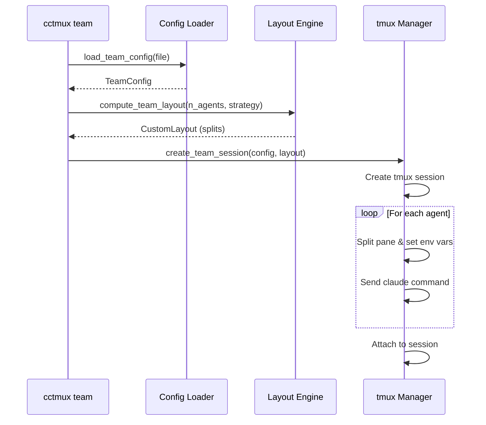
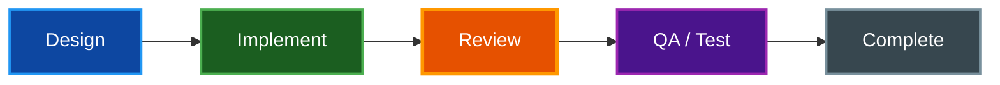
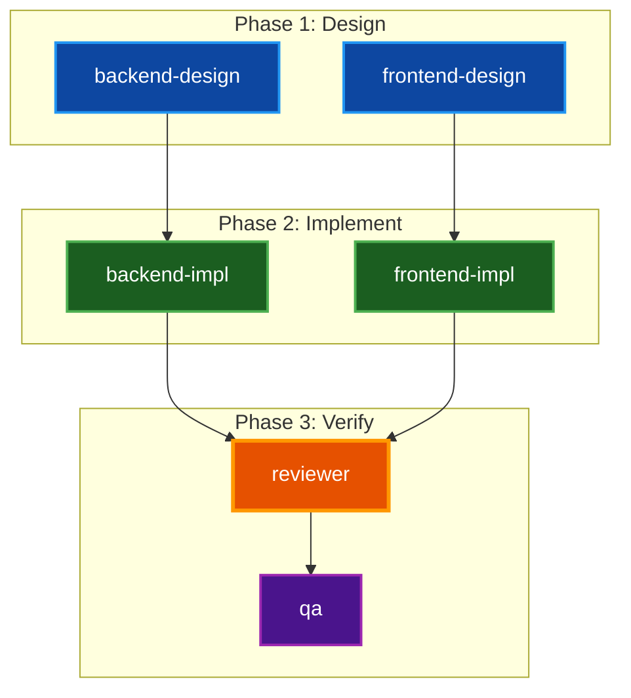

# CC2CC Team Mode

Launch and coordinate multiple Claude Code instances as a collaborative team in a single tmux session. Each agent runs in its own pane with a role-specific system prompt, and all agents communicate through the [cc2cc](https://github.com/paulrobello/cc2cc) hub.

## Table of Contents

- [Overview](#overview)
- [Prerequisites](#prerequisites)
- [Quick Start](#quick-start)
- [Team Configuration](#team-configuration)
  - [Configuration File Formats](#configuration-file-formats)
  - [TeamConfig Fields](#teamconfig-fields)
  - [TeamAgent Fields](#teamagent-fields)
- [Layout Strategies](#layout-strategies)
  - [Grid](#grid)
  - [Columns](#columns)
  - [Rows](#rows)
- [How It Works](#how-it-works)
  - [Session Creation](#session-creation)
  - [Per-Pane Environment](#per-pane-environment)
  - [Agent Launch Flags](#agent-launch-flags)
  - [cc2cc Integration](#cc2cc-integration)
- [Designing a Team](#designing-a-team)
  - [Role Separation](#role-separation)
  - [Prompt Guidelines](#prompt-guidelines)
  - [Task Flow](#task-flow)
- [Team Lead Workflow](#team-lead-workflow)
  - [Startup Checklist](#startup-checklist)
  - [Task Creation](#task-creation)
  - [Communication Patterns](#communication-patterns)
  - [Progress Monitoring](#progress-monitoring)
  - [Handling Issues](#handling-issues)
- [Example: Full-Stack Team](#example-full-stack-team)
- [CLI Reference](#cli-reference)
- [Troubleshooting](#troubleshooting)
- [Related Documentation](#related-documentation)

## Overview

**Purpose:** Enable multiple Claude Code instances to work on a project simultaneously, each with a specialized role, communicating and coordinating through shared task lists and the cc2cc messaging hub.

**Key Features:**
- N agents in a single tmux session, each in its own pane
- Role-specific system prompts injected via `--append-system-prompt`
- Shared task list across all agents via `CLAUDE_CODE_TASK_LIST_ID`
- Inter-agent messaging through cc2cc topics and direct messages
- Three layout strategies: grid, columns, rows
- Optional monitor pane for real-time task progress
- Per-agent Claude CLI arg overrides

## Prerequisites

Before launching a team session, ensure the following are in place:

1. **cctmux installed** with team support
2. **cc2cc hub running** — the message broker that agents communicate through
   ```bash
   # In the cc2cc project directory
   make dev-redis && make dev-hub
   ```
3. **cc2cc plugin installed** in Claude Code
   ```bash
   claude plugin add <path-to-cc2cc>/skill
   ```
4. **Environment variables set:**
   - `CC2CC_HUB_URL` — URL of the cc2cc hub
   - `CC2CC_API_KEY` — API key for hub authentication
5. **tmux** installed and available in `$PATH`

## Quick Start

### 1. Create a Team Config

```yaml
# team.yaml
team:
  name: my-team
  shared_task_list: true
  layout: grid
  monitor: true
  agents:
    - role: architect
      prompt: |
        You lead the team. Create tasks, review work, coordinate via cc2cc.
    - role: implementer
      prompt: |
        Pick up tasks tagged [implementer] and implement them.
    - role: tester
      prompt: |
        Write and run tests for completed features.
```

### 2. Launch the Team

```bash
cctmux team team.yaml
```

### 3. Preview Without Executing

```bash
cctmux team team.yaml --dry-run
```

The `--dry-run` flag prints all tmux commands that would be executed without running them.

## Team Configuration

### Configuration File Formats

Team config can live in two places:

**Standalone file** — a dedicated YAML file passed as an argument:

```bash
cctmux team team.yaml
```

**Embedded in `.cctmux.yaml`** — add a `team:` key to the project config:

```yaml
default_layout: cc-mon
task_list_id: true

team:
  layout: columns
  agents:
    - role: frontend
      prompt: "Implement frontend components."
    - role: backend
      prompt: "Implement API endpoints."
```

When no file argument is given, `cctmux team` reads the `team:` section from `.cctmux.yaml`:

```bash
cctmux team
```

### TeamConfig Fields

| Field | Type | Default | Description |
|-------|------|---------|-------------|
| `name` | string | project name | Team name used for session naming |
| `shared_task_list` | boolean | `true` | Share `CLAUDE_CODE_TASK_LIST_ID` across all agents |
| `layout` | string | `grid` | Pane layout strategy: `grid`, `columns`, or `rows` |
| `monitor` | boolean | `false` | Add a `cctmux-tasks` monitor pane at the bottom |
| `agents` | list | (required) | List of `TeamAgent` definitions |

### TeamAgent Fields

| Field | Type | Default | Description |
|-------|------|---------|-------------|
| `role` | string | (required) | Agent role name (e.g., `architect`, `implementer`) |
| `prompt` | string | `""` | Role-specific system prompt injected via `--append-system-prompt` |
| `model` | string | `null` | Claude model to use via `--model` (e.g., `sonnet`, `opus`) |
| `claude_args` | string | `null` | Per-agent Claude CLI arg overrides |

## Layout Strategies

The `layout` field controls how agent panes are arranged in the tmux window.

### Grid

The default strategy. Arranges panes in a balanced rectangular grid.

```
2 agents:  [agent-0 | agent-1]

3 agents:  [agent-0 | agent-1]
           [        | agent-2]

4 agents:  [agent-0 | agent-1]
           [agent-2 | agent-3]

6 agents:  [agent-0 | agent-1 | agent-2]
           [agent-3 | agent-4 | agent-5]
```

The grid algorithm calculates dimensions as `cols = ceil(sqrt(n))` and distributes surplus cells to keep the first agent's pane large.

### Columns

All agent panes arranged side-by-side horizontally:

```
3 agents:  [agent-0 | agent-1 | agent-2]
```

Best for 2-3 agents on wide displays.

### Rows

All agent panes stacked vertically:

```
3 agents:  [agent-0]
           [agent-1]
           [agent-2]
```

Best for 2-3 agents on tall displays.

> **Note:** When `monitor: true`, an additional `cctmux-tasks` pane is appended at the bottom of any layout.

## How It Works

### Session Creation



The `create_team_session()` function in `tmux_manager.py`:

1. Creates a new tmux session named after the team or project
2. Calls `compute_team_layout()` to determine pane split dimensions
3. Splits the session window into N panes using the computed layout
4. For each pane, exports environment variables and sends the `claude` command with role-specific flags

### Per-Pane Environment

Each agent pane receives these environment variables:

| Variable | Value | Purpose |
|----------|-------|---------|
| `CCTMUX_SESSION` | session name | Identify the session from within panes |
| `CCTMUX_PROJECT_DIR` | absolute path | Project directory for file operations |
| `CLAUDE_CODE_TASK_LIST_ID` | session name | Shared task list (when `shared_task_list: true`) |
| `CC2CC_SESSION_ID` | unique UUID | Per-pane session ID to prevent cc2cc file races |
| `CLAUDE_CODE_EXPERIMENTAL_AGENT_TEAMS` | `"1"` | Enable experimental agent teams feature |

### Agent Launch Flags

Each Claude instance is launched with:

- `--append-system-prompt` — injects the agent's role prompt
- `--name` — set to the agent's `role` value for identification
- `--dangerously-skip-permissions` — enables autonomous operation without interactive prompts
- Per-agent `claude_args` — overrides default Claude CLI args when specified

### cc2cc Integration

All agents auto-subscribe to the project's cc2cc topic on connect. This enables:

- **Topic broadcasts** — team-wide announcements via `publish_topic`
- **Direct messages** — 1:1 communication via `send_message`
- **Role routing** — send to `role:<name>` to reach any agent with that role
- **Inbox polling** — agents call `get_messages()` to check for incoming messages

## Designing a Team

### Role Separation

Effective teams separate concerns clearly. Common patterns:

| Pattern | Roles | Best For |
|---------|-------|----------|
| **Design + Implement** | designer, implementer | Separating architecture from coding |
| **Frontend + Backend** | frontend, backend | Full-stack projects |
| **Build + Review + Test** | implementer, reviewer, qa | Quality-focused workflows |
| **Lead + Specialists** | team-lead, 2-5 specialists | Complex multi-domain tasks |

> **Tip:** Avoid teams larger than 6 agents. Coordination overhead grows with team size, and agents may conflict on shared files.

### Prompt Guidelines

Write role prompts that are:

- **Specific** — define exact responsibilities and boundaries
- **Workflow-oriented** — include numbered steps for the agent to follow
- **Boundary-aware** — state what the agent should NOT do
- **Communication-aware** — specify when and how to notify other agents

```yaml
- role: backend-design
  prompt: |
    You are the Backend Design Specialist.

    Responsibilities:
    - Design REST API contracts (endpoints, request/response shapes)
    - Create TypeScript types and Zod schemas
    - Document design decisions

    Workflow:
    1. Check the task list for [backend-design] tasks
    2. Read existing code to understand patterns
    3. Design the solution and write types/schemas
    4. Notify backend-impl via cc2cc when ready

    Do NOT implement business logic — focus on contracts and types.
```

### Task Flow

Teams work best with phased task flow:



Tag tasks with the target role in square brackets so agents can identify their work:

```
[backend-design] Design user authentication API contracts
[backend-impl]   Implement auth endpoints per design
[reviewer]       Review auth implementation
[qa]             Write tests for authentication flow
```

## Team Lead Workflow

The team lead is typically agent-0 (the first pane) and orchestrates the entire team.

### Startup Checklist

1. **Verify cc2cc connectivity** — call `ping()` to confirm the hub is reachable
2. **Set your role** — call `set_role('team-lead')`
3. **Verify the team** — call `list_instances()` to confirm all agents are connected
4. **Read the project** — understand README, CLAUDE.md, and existing patterns
5. **Run initial checks** — `make checkall` to verify the project builds
6. **Create tasks** — define work items tagged with agent roles

### Task Creation

Create tasks with clear structure:

```
TaskCreate:
  subject: "[backend-design] Design user authentication API"
  description: |
    Design the REST API for user authentication.

    Requirements:
    - POST /api/auth/login (email + password -> JWT)
    - POST /api/auth/register (email + password + name -> JWT)
    - GET /api/auth/me (JWT -> user profile)

    Write types to: src/types/auth.ts
    Write schemas to: src/schemas/auth.ts

    Acceptance: TypeScript compiles, schemas validate expected shapes.
    Dependencies: None (first task).
    Notify backend-impl via cc2cc when ready.
```

### Communication Patterns

| Pattern | Tool | When to Use |
|---------|------|-------------|
| Team-wide announcement | `publish_topic` | Phase transitions, blockers, status requests |
| Direct to one agent | `send_message` | Unblocking, answering questions, redirecting |
| Role-based routing | `send_message` to `role:<name>` | Notifying any agent in a role |
| Check inbox | `get_messages` | Regularly, to catch questions and status reports |

### Progress Monitoring

- **Shared task list** — all agents mark their tasks `in_progress` and `completed`
- **Monitor pane** — if `monitor: true`, a `cctmux-tasks -g` pane shows real-time progress with a dependency graph
- **Direct check-ins** — message idle agents for status updates

### Handling Issues

| Issue | Resolution |
|-------|------------|
| Agent stuck or idle | Check tmux pane visually, send cc2cc status query |
| Merge conflict | Broadcast pause, resolve conflict, broadcast resume |
| Design disagreement | Read both sides, make a decision, broadcast it |
| Failing checks | Route failure details to responsible implementer, create follow-up task |

## Example: Full-Stack Team

A 6-agent team for full-stack development (see `examples/team.yaml`):

```yaml
team:
  name: full-stack-team
  shared_task_list: true
  layout: grid
  monitor: true
  agents:
    - role: backend-design
      prompt: |
        You are the Backend Design Specialist.
        Design APIs, data models, and system architecture.
        Do NOT implement — focus on contracts and types.

    - role: frontend-design
      prompt: |
        You are the Frontend Design Specialist.
        Design UI components, layouts, and user interactions.
        Do NOT implement — focus on component contracts.

    - role: backend-impl
      prompt: |
        You are the Backend Implementor.
        Implement server-side code following designs from backend-design.
        Notify reviewer via cc2cc when code is ready.

    - role: frontend-impl
      prompt: |
        You are the Frontend Implementor.
        Build UI components following designs from frontend-design.
        Notify reviewer via cc2cc when components are ready.

    - role: reviewer
      prompt: |
        You are the Code Reviewer.
        Review all code for correctness, style, and security.
        Run make checkall before approving.

    - role: qa
      prompt: |
        You are the QA Engineer.
        Write and run tests for all implemented features.
        Report failures to the relevant implementor.
```

This team follows the phased flow: design (parallel) -> implement (parallel) -> review -> QA.



## CLI Reference

### Synopsis

```bash
cctmux team [TEAM_FILE] [OPTIONS]
```

### Arguments

| Argument | Description |
|----------|-------------|
| `TEAM_FILE` | Path to a team YAML file (optional; defaults to reading `team:` from `.cctmux.yaml`) |

### Options

| Option | Short | Description | Default |
|--------|-------|-------------|---------|
| `--dry-run` | `-n` | Preview tmux commands without executing | `false` |
| `--status-bar` | `-s` | Enable status bar with git/project info | `false` |
| `--verbose` | `-v` | Increase verbosity (stackable) | `0` |
| `--debug` | `-D` | Enable debug output | `false` |

### Examples

```bash
# Launch team from standalone config
cctmux team team.yaml

# Launch team from .cctmux.yaml team: section
cctmux team

# Preview what would happen
cctmux team team.yaml --dry-run

# Launch with status bar
cctmux team team.yaml -s
```

## Troubleshooting

### cc2cc hub not reachable

**Symptom:** Agents launch but cannot communicate.

**Solution:** Start the cc2cc hub:
```bash
# In the cc2cc project directory
make dev-redis && make dev-hub
```

Verify `CC2CC_HUB_URL` and `CC2CC_API_KEY` are set in your environment.

### Agent not announcing on topic

**Symptom:** `list_instances()` shows fewer agents than expected.

**Solution:** Check the agent's tmux pane visually. The agent may have crashed on startup or be waiting for user input. Agents launched with `--dangerously-skip-permissions` should not require interactive prompts.

### Session already exists

**Symptom:** Error message about an existing tmux session.

**Solution:** Either attach to the existing session or kill it first:
```bash
# Attach to existing session
tmux attach -t <session-name>

# Kill existing session and relaunch
tmux kill-session -t <session-name>
cctmux team team.yaml
```

### Task list not shared

**Symptom:** Agents create separate task lists instead of sharing one.

**Solution:** Ensure `shared_task_list: true` in the team config. This sets `CLAUDE_CODE_TASK_LIST_ID` to the session name across all panes.

### Agents editing the same file

**Symptom:** Merge conflicts or overwritten changes.

**Solution:** Design role boundaries to minimize file overlap. If conflicts occur, the team lead should broadcast a pause, resolve the conflict, and broadcast a resume.

## Related Documentation

- [CLI Reference](CLI_REFERENCE.md) - Full command documentation
- [Configuration](CONFIGURATION.md) - All configuration options
- [Architecture](ARCHITECTURE.md) - System design and data flow
- [Layouts](LAYOUTS.md) - Layout types and customization
- [Quick Start](QUICKSTART.md) - Getting started guide
