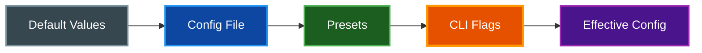

# Configuration Reference

Complete reference for cctmux configuration options, presets, and customization.

## Table of Contents

- [Overview](#overview)
- [Configuration File](#configuration-file)
- [Configuration Options](#configuration-options)
- [Monitor Configurations](#monitor-configurations)
- [Presets](#presets)
- [CLI Overrides](#cli-overrides)
- [Environment Variables](#environment-variables)
- [Related Documentation](#related-documentation)

## Overview

cctmux uses a YAML configuration file for persistent settings. Configuration values can be overridden via CLI flags, with presets providing quick access to common configurations.



**Priority Order** (highest to lowest):
1. CLI flags
2. Preset configuration (if `--preset` specified)
3. Configuration file
4. Default values

## Configuration File

### Location

The configuration file is located at:

```
~/.config/cctmux/config.yaml
```

### Creating the Config File

Create a default configuration file:

```bash
cctmux init-config
```

### Viewing Current Configuration

Display the effective configuration:

```bash
cctmux --dump-config
```

### Example Configuration

```yaml
# Default layout for new sessions
default_layout: default

# Enable tmux status bar
status_bar_enabled: false

# Maximum history entries to keep
max_history_entries: 50

# Default arguments for claude command
default_claude_args: null

# Set CLAUDE_CODE_TASK_LIST_ID environment variable
task_list_id: false

# Session monitor settings
session_monitor:
  show_thinking: true
  show_results: true
  show_progress: true
  show_system: false
  show_snapshots: false
  show_cwd: false
  show_threading: false
  show_stop_reasons: true
  show_turn_durations: true
  show_hook_errors: true
  show_service_tier: false
  show_sidechain: true
  max_events: 50

# Task monitor settings
task_monitor:
  show_owner: true
  show_metadata: false
  show_description: true
  show_graph: true
  show_table: true
  show_acceptance: true
  show_work_log: false
  max_tasks: 100

# Activity monitor settings
activity_monitor:
  default_days: 7
  show_heatmap: true
  show_cost: true
  show_tool_usage: true
  show_model_usage: true

# Agent monitor settings
agent_monitor:
  inactive_timeout: 300.0  # seconds; 0 to disable

# Ralph monitor settings
ralph_monitor:
  show_table: true
  show_timeline: true
  show_prompt: false
  show_task_progress: true
  max_iterations_visible: 20

# Custom layouts (advanced)
custom_layouts: []
```

## Configuration Options

### Main Configuration

| Option | Type | Default | Description |
|--------|------|---------|-------------|
| `default_layout` | string | `default` | Layout for new sessions |
| `status_bar_enabled` | boolean | `false` | Enable tmux status bar |
| `max_history_entries` | integer | `50` | Max session history entries |
| `default_claude_args` | string | `null` | Default claude CLI arguments |
| `task_list_id` | boolean | `false` | Set task list ID env var |
| `custom_layouts` | list | `[]` | Custom layout definitions |

### Layout Options

| Value | Description |
|-------|-------------|
| `default` | No initial split |
| `editor` | 70/30 horizontal split |
| `monitor` | 80/20 vertical split |
| `triple` | Main + 2 side panes |
| `cc-mon` | Claude + session + tasks monitors |
| `full-monitor` | Claude + session + tasks + activity monitors |
| `dashboard` | Large activity dashboard with session sidebar |
| `ralph` | Shell + ralph monitor side-by-side |
| `ralph-full` | Shell + ralph monitor + task monitor |

## Monitor Configurations

### Session Monitor (`session_monitor`)

| Option | Type | Default | Description |
|--------|------|---------|-------------|
| `show_thinking` | boolean | `true` | Show thinking blocks |
| `show_results` | boolean | `true` | Show tool results |
| `show_progress` | boolean | `true` | Show progress events |
| `show_system` | boolean | `false` | Show system messages |
| `show_snapshots` | boolean | `false` | Show file snapshots |
| `show_cwd` | boolean | `false` | Show working directory |
| `show_threading` | boolean | `false` | Show message threading |
| `show_stop_reasons` | boolean | `true` | Show stop reason stats |
| `show_turn_durations` | boolean | `true` | Show turn duration stats |
| `show_hook_errors` | boolean | `true` | Show hook error info |
| `show_service_tier` | boolean | `false` | Show API service tier |
| `show_sidechain` | boolean | `true` | Show sidechain count |
| `max_events` | integer | `50` | Max events to display |

### Task Monitor (`task_monitor`)

| Option | Type | Default | Description |
|--------|------|---------|-------------|
| `show_owner` | boolean | `true` | Show owner column |
| `show_metadata` | boolean | `false` | Show custom metadata |
| `show_description` | boolean | `true` | Show task descriptions |
| `show_graph` | boolean | `true` | Show dependency graph |
| `show_table` | boolean | `true` | Show task table |
| `show_acceptance` | boolean | `true` | Show acceptance criteria |
| `show_work_log` | boolean | `false` | Show work log entries |
| `max_tasks` | integer | `100` | Max tasks to display |

### Activity Monitor (`activity_monitor`)

| Option | Type | Default | Description |
|--------|------|---------|-------------|
| `default_days` | integer | `7` | Days to show in heatmap |
| `show_heatmap` | boolean | `true` | Show activity heatmap |
| `show_cost` | boolean | `true` | Show cost estimates |
| `show_tool_usage` | boolean | `true` | Show tool usage stats |
| `show_model_usage` | boolean | `true` | Show model usage table |

### Agent Monitor (`agent_monitor`)

| Option | Type | Default | Description |
|--------|------|---------|-------------|
| `inactive_timeout` | float | `300.0` | Seconds before hiding inactive agents (0 to disable) |

### Ralph Monitor (`ralph_monitor`)

| Option | Type | Default | Description |
|--------|------|---------|-------------|
| `show_table` | boolean | `true` | Show iteration data table |
| `show_timeline` | boolean | `true` | Show iteration timeline |
| `show_prompt` | boolean | `false` | Show iteration prompts |
| `show_task_progress` | boolean | `true` | Show task completion progress |
| `max_iterations_visible` | integer | `20` | Max iterations to display |

## Presets

Presets provide quick access to common configurations for all monitors.

### Available Presets

| Preset | Description |
|--------|-------------|
| `default` | Standard configuration |
| `minimal` | Essential information only |
| `verbose` | All information displayed |
| `debug` | Maximum detail for troubleshooting |

### Using Presets

```bash
# Task monitor with verbose preset
cctmux-tasks --preset verbose

# Session monitor with minimal preset
cctmux-session --preset minimal

# Activity with debug preset
cctmux-activity --preset debug

# Ralph monitor with verbose preset
cctmux-ralph --preset verbose
```

### Preset Details

#### Minimal Preset

Reduces visual noise for focused work:

**Session Monitor:**
- Hide thinking, results, progress, sidechain
- Hide stop reasons, turn durations, hook errors
- Max 20 events

**Task Monitor:**
- Hide owner, description, metadata, acceptance criteria
- Show graph only (no table)
- Max 30 tasks

**Activity Monitor:**
- Hide heatmap
- Hide tool usage

**Ralph Monitor:**
- Hide timeline
- Hide prompt

**Agent Monitor:**
- Uses default settings

#### Verbose Preset

Shows comprehensive information:

**Session Monitor:**
- Show all event types including system
- Show cwd, stop reasons, turn durations, hook errors
- Show service tier, sidechain
- Max 100 events

**Task Monitor:**
- Show all columns including metadata, acceptance criteria, work logs
- Max 200 tasks

**Activity Monitor:**
- 14-day heatmap
- Show all usage tables

**Ralph Monitor:**
- Show table, timeline, prompt, task progress

**Agent Monitor:**
- Uses default settings

#### Debug Preset

Maximum detail for troubleshooting:

**Session Monitor:**
- Show everything including snapshots and threading
- Show service tier, sidechain, all statistics
- Max 200 events

**Task Monitor:**
- Show all data including metadata, acceptance criteria, work logs
- Max 500 tasks

**Activity Monitor:**
- 30-day heatmap
- All statistics visible

**Ralph Monitor:**
- Show table, timeline, prompt, task progress
- Max 50 iterations visible

**Agent Monitor:**
- Uses default settings

## CLI Overrides

CLI flags always take precedence over configuration file and presets.

### Override Examples

```bash
# Override max events from config
cctmux-session -m 100

# Override preset value
cctmux-tasks --preset minimal --show-metadata

# Override config default layout
cctmux -l cc-mon

# Override poll interval
cctmux-session -i 0.25
```

### Combining Presets and Overrides

When using a preset with CLI flags, the preset is applied first, then CLI flags override specific values:

```bash
# Start with minimal preset, but show thinking
cctmux-session --preset minimal --show-thinking
# Result: minimal config but with thinking blocks visible
```

## Environment Variables

cctmux sets environment variables in tmux sessions:

| Variable | Description |
|----------|-------------|
| `CCTMUX_SESSION` | Current tmux session name |
| `CCTMUX_PROJECT_DIR` | Project directory path |
| `CLAUDE_CODE_TASK_LIST_ID` | Session name (if `--task-list-id` enabled) |

### Checking Environment Variables

Inside a cctmux session:

```bash
echo $CCTMUX_SESSION
echo $CCTMUX_PROJECT_DIR
```

### Task List ID

Enable automatic task list ID assignment:

```yaml
# In config.yaml
task_list_id: true
```

Or via CLI:

```bash
cctmux -T
```

This sets `CLAUDE_CODE_TASK_LIST_ID` to the session name, allowing tasks to be scoped to the session.

## Related Documentation

- [CLI Reference](CLI_REFERENCE.md) - Command documentation
- [Architecture](ARCHITECTURE.md) - System design
- [Quick Start](QUICKSTART.md) - Getting started guide
- [Layouts](LAYOUTS.md) - Layout descriptions and diagrams
