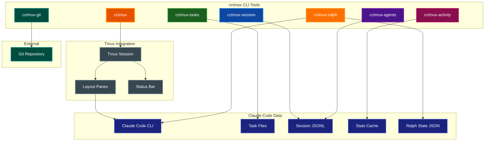

# cctmux Documentation

Comprehensive documentation for cctmux, a CLI tool that launches Claude Code inside tmux with session management and real-time monitoring capabilities.

## Table of Contents

- [Overview](#overview)
- [Documentation Index](#documentation-index)
- [Quick Links](#quick-links)

## Overview

cctmux provides a seamless integration between Claude Code and tmux, enabling:

- **Session Management**: Create and attach to named tmux sessions per project
- **Layout Presets**: Predefined pane arrangements for different workflows (default, editor, monitor, triple, cc-mon, full-monitor, dashboard, ralph, ralph-full, git-mon)
- **Real-time Monitoring**: Track tasks, session events, subagents, and usage statistics
- **Configuration**: YAML-based settings with CLI overrides and presets
- **Ralph Loop Automation**: Automated iterative Claude Code execution with task tracking, cost monitoring, and completion detection



## Documentation Index

| Document | Description |
|----------|-------------|
| [QUICKSTART.md](QUICKSTART.md) | Get started with cctmux in minutes |
| [ARCHITECTURE.md](ARCHITECTURE.md) | System design and data flow |
| [CLI_REFERENCE.md](CLI_REFERENCE.md) | Complete reference for all CLI commands |
| [LAYOUTS.md](LAYOUTS.md) | Predefined layouts reference |
| [SKILL_GUIDE.md](SKILL_GUIDE.md) | Using the cc-tmux skill with Claude |
| [CONFIGURATION.md](CONFIGURATION.md) | Configuration file and presets |
| [DOCUMENTATION_STYLE_GUIDE.md](DOCUMENTATION_STYLE_GUIDE.md) | Documentation standards and formatting |

## Quick Links

### CLI Commands

| Command | Purpose |
|---------|---------|
| `cctmux` | Launch Claude Code in a tmux session |
| `cctmux install-skill` | Install the cc-tmux skill to `~/.claude/skills/` |
| `cctmux init-config` | Create default configuration file |
| `cctmux-tasks` | Monitor Claude Code tasks in real-time |
| `cctmux-session` | Monitor Claude Code session stream in real-time |
| `cctmux-agents` | Monitor subagent activity in real-time |
| `cctmux-activity` | Display usage statistics dashboard |
| `cctmux-git` | Monitor git repository status in real-time |
| `cctmux-ralph` | Monitor a running Ralph Loop dashboard |
| `cctmux-ralph start` | Start a Ralph Loop from a project file |
| `cctmux-ralph init` | Create a template Ralph project file |
| `cctmux-ralph cancel` | Cancel an active Ralph Loop |
| `cctmux-ralph status` | Show current Ralph Loop status (one-shot) |

### Common Operations

```bash
# Start a new session for current project
cctmux

# Start with monitoring layout
cctmux -l cc-mon

# Install the cc-tmux skill for Claude
cctmux install-skill

# Create default config file
cctmux init-config

# Monitor tasks in another terminal
cctmux-tasks

# View session stream activity
cctmux-session

# Monitor subagent activity
cctmux-agents

# Check usage statistics
cctmux-activity

# Monitor git repository status
cctmux-git

# Start with git monitor layout
cctmux -l git-mon

# Create a Ralph project template
cctmux-ralph init

# Start a Ralph Loop
cctmux-ralph start ralph-project.md

# Monitor a running Ralph Loop
cctmux-ralph

# Check Ralph Loop status
cctmux-ralph status

# Cancel a running Ralph Loop
cctmux-ralph cancel
```

## Related Documentation

- [Claude Code Documentation](https://docs.anthropic.com/en/docs/claude-code)
- [tmux Manual](https://man7.org/linux/man-pages/man1/tmux.1.html)
