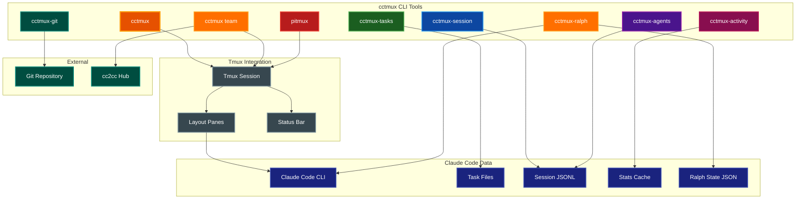

# cctmux Documentation

Comprehensive documentation for cctmux, a CLI tool that launches Claude Code inside tmux with session management and real-time monitoring capabilities.

## Table of Contents

- [Overview](#overview)
- [Documentation Index](#documentation-index)
- [Quick Links](#quick-links)

## Overview

cctmux provides a seamless integration between Claude Code and tmux, enabling:

- **Session Management**: Create and attach to named tmux sessions per project
- **Layout Presets**: Predefined pane arrangements for different workflows (default, editor, monitor, triple, cc-mon, full-monitor, dashboard, ralph, ralph-full, git-mon)
- **Custom Layouts**: Define your own pane arrangements with split direction, size, target pane, and commands
- **Real-time Monitoring**: Track tasks, session events, subagents, and usage statistics
- **Configuration**: YAML-based settings with layered merging (user, project, local), CLI overrides, and presets
- **Team Mode**: Launch multiple Claude Code instances as a coordinated team with role-specific prompts and cc2cc communication
- **Ralph Loop Automation**: Automated iterative Claude Code execution with task tracking, cost monitoring, and completion detection
- **pi Agent Integration**: Launch the pi coding agent inside tmux via the `pitmux` entry point, with its own skill sync and session prefix


```mermaid
graph TB
    subgraph "cctmux CLI Tools"
        Main[cctmux]
        Team[cctmux team]
        Tasks[cctmux-tasks]
        Session[cctmux-session]
        Agents[cctmux-agents]
        Activity[cctmux-activity]
        GitMon[cctmux-git]
        Ralph[cctmux-ralph]
        Pitmux[pitmux]
    end

    subgraph "Tmux Integration"
        TmuxSession[Tmux Session]
        Panes[Layout Panes]
        StatusBar[Status Bar]
    end

    subgraph "Claude Code Data"
        Claude[Claude Code CLI]
        TaskFiles[Task Files]
        SessionFiles[Session JSONL]
        StatsCache[Stats Cache]
        RalphState[Ralph State JSON]
    end

    subgraph "External"
        GitRepo[Git Repository]
        CC2CC[cc2cc Hub]
    end

    Main --> TmuxSession
    Team --> TmuxSession
    Team --> CC2CC
    Pitmux --> TmuxSession
    TmuxSession --> Panes
    TmuxSession --> StatusBar
    Panes --> Claude

    Tasks --> TaskFiles
    Session --> SessionFiles
    Agents --> SessionFiles
    Activity --> StatsCache
    GitMon --> GitRepo
    Ralph --> RalphState
    Ralph --> Claude

    style Main fill:#e65100,stroke:#ff9800,stroke-width:3px,color:#ffffff
    style Team fill:#ff6f00,stroke:#ffa726,stroke-width:2px,color:#ffffff
    style Tasks fill:#1b5e20,stroke:#4caf50,stroke-width:2px,color:#ffffff
    style Session fill:#0d47a1,stroke:#2196f3,stroke-width:2px,color:#ffffff
    style Agents fill:#4a148c,stroke:#9c27b0,stroke-width:2px,color:#ffffff
    style Activity fill:#880e4f,stroke:#c2185b,stroke-width:2px,color:#ffffff
    style GitMon fill:#004d40,stroke:#00897b,stroke-width:2px,color:#ffffff
    style Ralph fill:#ff6f00,stroke:#ffa726,stroke-width:2px,color:#ffffff
    style Pitmux fill:#b71c1c,stroke:#f44336,stroke-width:2px,color:#ffffff
    style TmuxSession fill:#37474f,stroke:#78909c,stroke-width:2px,color:#ffffff
    style Panes fill:#37474f,stroke:#78909c,stroke-width:2px,color:#ffffff
    style StatusBar fill:#37474f,stroke:#78909c,stroke-width:2px,color:#ffffff
    style Claude fill:#1a237e,stroke:#3f51b5,stroke-width:2px,color:#ffffff
    style TaskFiles fill:#1a237e,stroke:#3f51b5,stroke-width:2px,color:#ffffff
    style SessionFiles fill:#1a237e,stroke:#3f51b5,stroke-width:2px,color:#ffffff
    style StatsCache fill:#1a237e,stroke:#3f51b5,stroke-width:2px,color:#ffffff
    style RalphState fill:#1a237e,stroke:#3f51b5,stroke-width:2px,color:#ffffff
    style GitRepo fill:#004d40,stroke:#00897b,stroke-width:2px,color:#ffffff
    style CC2CC fill:#004d40,stroke:#00897b,stroke-width:2px,color:#ffffff
```

## Documentation Index

| Document | Description |
|----------|-------------|
| [QUICKSTART.md](QUICKSTART.md) | Get started with cctmux in minutes |
| [ARCHITECTURE.md](ARCHITECTURE.md) | System design and data flow |
| [CLI_REFERENCE.md](CLI_REFERENCE.md) | Complete reference for all CLI commands |
| [LAYOUTS.md](LAYOUTS.md) | Predefined and custom layouts reference |
| [SKILL_GUIDE.md](SKILL_GUIDE.md) | Using the cc-tmux skill with Claude |
| [CONFIGURATION.md](CONFIGURATION.md) | Configuration file, presets, and layered merging |
| [CC2CC_TEAM.md](CC2CC_TEAM.md) | Team mode and multi-agent coordination |
| [DOCUMENTATION_STYLE_GUIDE.md](DOCUMENTATION_STYLE_GUIDE.md) | Documentation standards and formatting |

## Quick Links

### CLI Commands

| Command | Purpose |
|---------|---------|
| `cctmux` | Launch Claude Code in a tmux session |
| `cctmux install-skill` | Install the cc-tmux skill to `~/.claude/skills/` |
| `cctmux init-config` | Create default configuration file |
| `cctmux config validate` | Validate all config files and report warnings |
| `cctmux config show` | Show effective merged configuration |
| `cctmux layout list` | List all available layouts (built-in and custom) |
| `cctmux layout show` | Show layout details |
| `cctmux layout add` | Create a new custom layout |
| `cctmux layout edit` | Edit an existing custom layout |
| `cctmux layout remove` | Remove a custom layout |
| `cctmux team [file]` | Launch a team of Claude Code instances |
| `cctmux-tasks` | Monitor Claude Code tasks in real-time |
| `cctmux-session` | Monitor Claude Code session stream in real-time |
| `cctmux-agents` | Monitor subagent activity in real-time |
| `cctmux-activity` | Display usage statistics dashboard |
| `cctmux-git` | Monitor git repository status in real-time |
| `cctmux-ralph` | Monitor a running Ralph Loop dashboard |
| `cctmux-ralph start` | Start a Ralph Loop from a project file |
| `cctmux-ralph init` | Create a template Ralph project file |
| `cctmux-ralph stop` | Stop after the current iteration finishes |
| `cctmux-ralph cancel` | Cancel an active Ralph Loop immediately |
| `cctmux-ralph status` | Show current Ralph Loop status (one-shot) |
| `pitmux` | Launch the pi coding agent in a tmux session |

### Common Operations

```bash
# Start a new session for current project
cctmux

# Start with monitoring layout
cctmux -l cc-mon

# Install the cc-tmux skill for Claude
cctmux install-skill

# Create default config file
cctmux init-config

# Validate config files
cctmux config validate

# Show effective merged config
cctmux config show

# List all layouts (built-in and custom)
cctmux layout list

# Show details for a specific layout
cctmux layout show cc-mon

# Create a custom layout (opens in $EDITOR)
cctmux layout add my-layout

# Create a custom layout based on an existing one
cctmux layout add my-layout --from cc-mon

# Launch a team of Claude Code instances
cctmux team team.yaml

# Launch team from .cctmux.yaml team: section
cctmux team

# Monitor tasks in another terminal
cctmux-tasks

# View session stream activity
cctmux-session

# Monitor subagent activity
cctmux-agents

# Check usage statistics
cctmux-activity

# Monitor git repository status
cctmux-git

# Start with git monitor layout
cctmux -l git-mon

# Create a Ralph project template
cctmux-ralph init

# Start a Ralph Loop
cctmux-ralph start ralph-project.md

# Monitor a running Ralph Loop
cctmux-ralph

# Check Ralph Loop status
cctmux-ralph status

# Stop after current iteration
cctmux-ralph stop

# Cancel a running Ralph Loop immediately
cctmux-ralph cancel

# Launch the pi coding agent in a tmux session
pitmux

# Launch pi with a specific layout and extra arguments
pitmux -l cc-mon --pi-args "--model anthropic/claude-sonnet-4-6"

# Resume a previous pi session
pitmux --resume

# Continue the last pi session
pitmux --continue

# Select from recent pi sessions
pitmux --recent

# Dry-run to preview commands
pitmux -n
```

## Related Documentation

- [Claude Code Documentation](https://docs.anthropic.com/en/docs/claude-code)
- [tmux Manual](https://man7.org/linux/man-pages/man1/tmux.1.html)
