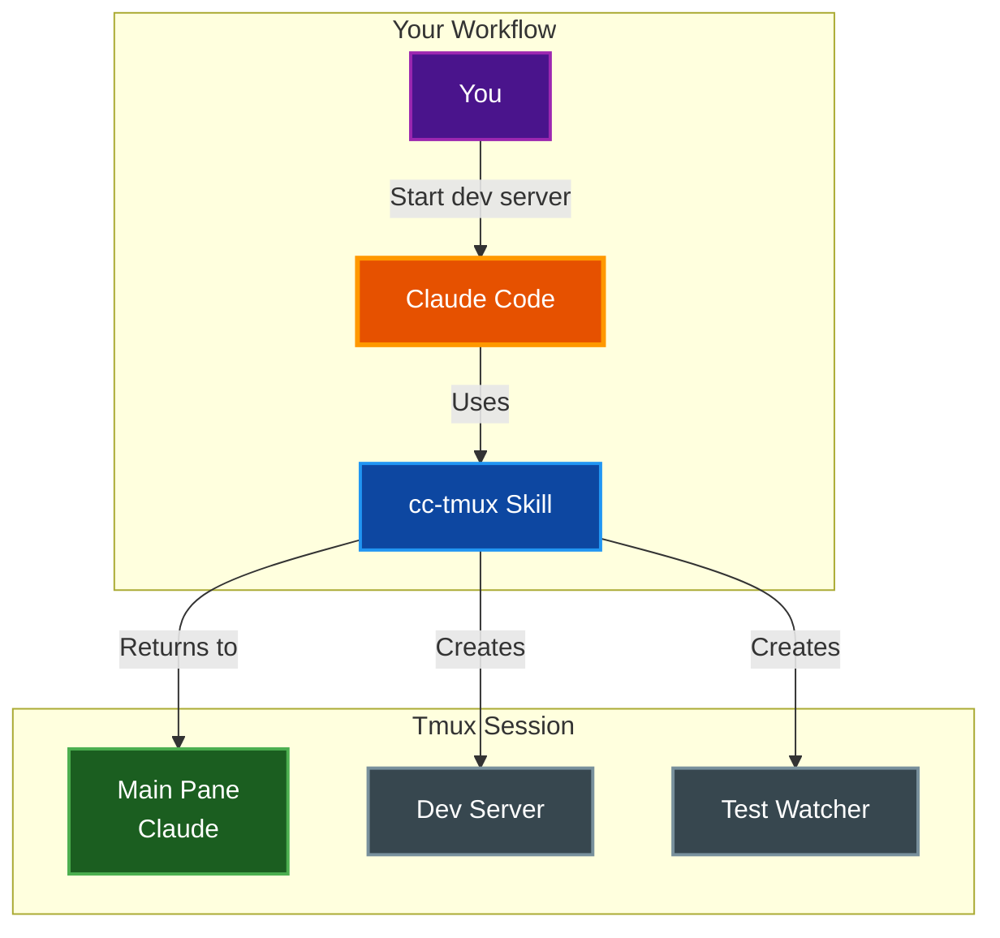

# Skill Guide

Guide to using the cc-tmux skill with Claude Code. This skill enables Claude to manage tmux panes for development workflows within cctmux sessions.

## Table of Contents

- [Overview](#overview)
- [Installation](#installation)
- [Invoking the Skill](#invoking-the-skill)
- [What Claude Can Do](#what-claude-can-do)
- [Common Workflows](#common-workflows)
- [Example Prompts](#example-prompts)
- [How It Works](#how-it-works)
- [Best Practices](#best-practices)
- [Environment Variables](#environment-variables)
- [Troubleshooting](#troubleshooting)
- [Related Documentation](#related-documentation)

## Overview

The cc-tmux skill teaches Claude how to work within tmux sessions created by cctmux. When the skill is active, Claude can:

- Detect when running in a cctmux session
- Create and manage tmux panes
- Launch development servers, watchers, and test runners
- Navigate between panes
- Stop and restart processes



## Installation

Install the skill to your Claude skills directory using the `install-skill` subcommand:

```bash
cctmux install-skill
```

This copies the skill files from the package's `skill/cc-tmux/` directory to `~/.claude/skills/cc-tmux/`.

Verify installation:

```bash
ls ~/.claude/skills/cc-tmux/
# Should show: SKILL.md
```

## Invoking the Skill

### Automatic Detection

When you run Claude Code inside a cctmux session, Claude automatically has access to the session environment variables (`$CCTMUX_SESSION`, `$CCTMUX_PROJECT_DIR`).

### Explicit Invocation

You can explicitly ask Claude to use tmux capabilities:

```
Start a dev server in a side pane
```

```
Create a pane for running tests
```

```
Set up a development layout with server and tests
```

### Slash Command

Invoke the skill directly with the slash command:

```
/cc-tmux
```

This loads the full skill documentation into Claude's context.

## What Claude Can Do

### Pane Management

| Capability | Description |
|------------|-------------|
| **Create panes** | Split windows horizontally or vertically |
| **Size panes** | Specify percentage or absolute sizes |
| **Navigate** | Move focus between panes |
| **Resize** | Adjust pane dimensions |
| **Close** | Kill specific panes |

### Process Management

| Capability | Description |
|------------|-------------|
| **Launch** | Start processes in panes |
| **Stop** | Send Ctrl+C to stop processes |
| **Restart** | Stop and relaunch processes |
| **Monitor** | Check pane output |

### Layout Awareness

| Capability | Description |
|------------|-------------|
| **Inspect** | List current panes and sizes |
| **Check state** | Verify before creating new panes |
| **Return focus** | Always return to main pane |

## Common Workflows

### Web Development

Ask Claude to set up a development environment:

```
Set up a dev environment with:
- Next.js dev server in a side pane
- Tailwind watcher in a bottom pane
```

Claude will:
1. Check the current pane layout
2. Create a horizontal split for the dev server
3. Create a vertical split for the watcher
4. Launch both processes
5. Return focus to the main pane

```
┌──────────────────┬──────────────────┐
│                  │    next dev      │
│                  │      50%         │
│     Claude       ├──────────────────┤
│      50%         │    tailwind      │
│                  │      50%         │
│                  │                  │
└──────────────────┴──────────────────┘
```

### Test-Driven Development

Ask Claude to run tests in watch mode:

```
Run pytest in watch mode in a side pane
```

Claude will:
1. Create a side pane (typically 40% width)
2. Launch `pytest --watch` or similar
3. Return focus for continued development

### Debugging

Ask Claude to tail logs:

```
Create a bottom pane to tail the application logs
```

Claude will:
1. Create a small bottom pane (10-20% height)
2. Run the appropriate tail command
3. Keep the logs visible while you work

### Multiple Services

For microservices or full-stack development:

```
Set up panes for:
- Backend API server (port 8000)
- Frontend dev server (port 3000)
- Database logs
```

## Example Prompts

### Starting Services

```
Start the Flask development server in a side pane
```

```
Run npm run dev in a new pane on the right
```

```
Launch the Django server and Celery worker in separate panes
```

### Managing Panes

```
Show me the current pane layout
```

```
Resize the dev server pane to be wider
```

```
Close all panes except the main one
```

### Process Control

```
Restart the dev server - it crashed
```

```
Stop all background processes
```

```
Send Ctrl+C to the test pane
```

### Development Workflows

```
Set up my usual development environment for this React project
```

```
I need to debug - create a pane for logs and one for the debugger
```

```
Run the test suite in watch mode while I code
```

## How It Works

### Session Discovery

When inside a cctmux session, Claude can access these environment variables:

```bash
$CCTMUX_SESSION     # Session name (e.g., "my-project")
$CCTMUX_PROJECT_DIR # Project path (e.g., "/Users/you/my-project")
```

These variables are set at the tmux session level via `tmux set-environment` and exported into the main pane shell. Claude verifies it's in a cctmux session by checking for `$CCTMUX_SESSION` before attempting tmux operations.

When the `--task-list-id` / `-T` flag is used (or `task_list_id: true` in config), an additional variable `$CLAUDE_CODE_TASK_LIST_ID` is set to the session name, enabling Claude Code's task list feature.

### Pane ID Discovery (Critical)

**Pane indices are NOT always predictable.** Both window and pane indices can start at any value (0, 1, etc.). Hardcoding positional indices like `:0.0` or `:0.1` can target the wrong pane -- including sending commands to the main Claude pane.

Claude always uses stable pane IDs (e.g., `%15`, `%16`) instead of positional indices:

```bash
# Discover pane IDs and what's running in each
tmux list-panes -t "$CCTMUX_SESSION" -F "#{pane_id} #{pane_current_command}"

# Identify the main Claude pane (never send commands to it)
MAIN_PANE=$(tmux display-message -t "$CCTMUX_SESSION" -p "#{pane_id}")
```

### Create-Then-Launch Pattern

The skill teaches Claude to always:

1. **Create the pane first** with `-d -P -F "#{pane_id}"` to capture the pane ID without stealing focus
2. **Then send commands** via `send-keys` targeting the captured pane ID

This ensures:
- Proper shell environment
- Command history works
- Easy process restart
- Correct pane targeting via stable IDs

```bash
# Claude does this:
NEW_PANE=$(tmux split-window -d -P -F "#{pane_id}" -t "$CCTMUX_SESSION" -h -p 30)
tmux send-keys -t "$NEW_PANE" "npm run dev" Enter

# NOT this (anti-pattern):
tmux split-window -t "$CCTMUX_SESSION" -h "npm run dev"
```

### Pane Targeting

Claude uses pane IDs (e.g., `%15`, `%16`) instead of positional indices, which are stable and always correct:

```bash
# Capture pane ID when creating
NEW_PANE=$(tmux split-window -d -P -F "#{pane_id}" -t "$CCTMUX_SESSION" -h -p 30)
tmux send-keys -t "$NEW_PANE" "npm run dev" Enter

# Discover existing pane IDs
tmux list-panes -t "$CCTMUX_SESSION" -F "#{pane_id} #{pane_current_command}"
# Example output: %15 claude   %16 bash   %17 bash
tmux send-keys -t "%16" "npm run dev" Enter

# Identify the main Claude pane (never send commands to it)
MAIN_PANE=$(tmux display-message -t "$CCTMUX_SESSION" -p "#{pane_id}")
```

### Focus Management

Claude uses the `-d` flag when creating panes to avoid stealing focus. The main pane retains focus automatically, eliminating the need for explicit `select-pane` calls.

## Best Practices

### For Users

**Be specific about what you want:**
```
# Good
Start a dev server on port 3000 in a side pane

# Less clear
Run something for development
```

**Mention the process type:**
```
# Good
Run Jest in watch mode

# Less clear
Run tests
```

**Specify layout preferences:**
```
# Good
Create a small bottom pane (10 lines) for logs

# Less clear
Show me logs somewhere
```

### What Claude Follows

The skill teaches Claude these principles:

| Principle | Description |
|-----------|-------------|
| **Check first** | Always inspect current layout before creating panes |
| **Use pane IDs** | Target panes by ID (`%15`), never by positional index |
| **Create then launch** | Never pass commands to split-window directly |
| **Preserve focus** | Use `-d` flag to keep focus on main pane |
| **Identify main pane** | Never send commands to the Claude pane |
| **Present state to user** | Display current pane layout as a markdown table |
| **Limit panes** | Keep to 2-4 panes maximum |
| **Use panes wisely** | Only for long-running processes, not one-off commands |

## Environment Variables

cctmux sets the following environment variables at both the tmux session level and in the main pane shell:

| Variable | Description | Example |
|----------|-------------|---------|
| `CCTMUX_SESSION` | The tmux session name | `my-project` |
| `CCTMUX_PROJECT_DIR` | Absolute path to the project directory | `/Users/you/my-project` |
| `CLAUDE_CODE_TASK_LIST_ID` | Set to session name when `--task-list-id` is used | `my-project` |

Session names are sanitized from the project folder name: converted to lowercase, special characters removed, underscores and spaces replaced with hyphens.

## Troubleshooting

### "Not in cctmux session"

Claude reports it cannot detect a cctmux session.

**Solutions:**
1. Ensure you started Claude via `cctmux`, not directly
2. Check environment variables: `echo $CCTMUX_SESSION`
3. Restart the session: exit and run `cctmux` again

### Panes Not Being Created

Claude's commands seem to fail silently.

**Solutions:**
1. Check if you're inside tmux: `echo $TMUX`
2. Verify session exists: `tmux list-sessions`
3. Check for error messages in Claude's output

### Process Not Starting

The pane is created but the process does not run.

**Solutions:**
1. Verify the command works manually in a terminal
2. Check the working directory is correct
3. Look at the pane output using the pane ID: `tmux capture-pane -p -t "$PANE_ID"` (get the pane ID from `tmux list-panes -t "$CCTMUX_SESSION" -F "#{pane_id} #{pane_current_command}"`)

### "Pane too small"

Cannot create more splits.

**Solutions:**
1. Resize your terminal window
2. Close unused panes first
3. Use smaller split percentages

### Wrong Pane Targeted

Commands going to the wrong pane, or commands appearing in the Claude input.

**Solutions:**
1. Always use pane IDs (`%15`, `%16`) instead of positional indices (`.0`, `.1`)
2. List panes to discover IDs: `tmux list-panes -t "$CCTMUX_SESSION" -F "#{pane_id} #{pane_current_command}"`
3. Identify the main Claude pane first and never send commands to it: `tmux display-message -t "$CCTMUX_SESSION" -p "#{pane_id}"`
4. Close extra panes to simplify the layout

## Related Documentation

- [Layouts Reference](LAYOUTS.md) - Predefined layout options and diagrams
- [CLI Reference](CLI_REFERENCE.md) - Complete command documentation for all six entry points
- [Configuration](CONFIGURATION.md) - Configuration file options and presets
- [Quick Start](QUICKSTART.md) - Getting started guide
- [Architecture](ARCHITECTURE.md) - System architecture overview
